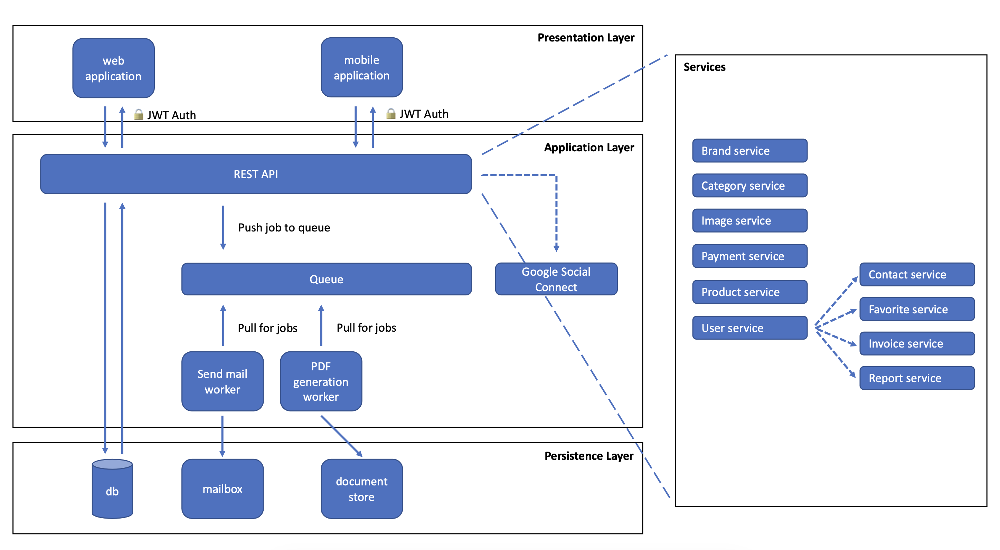

# Architecture

Version 5 of practicesoftwaretesting.com includes all the essential features you'd expect in a real-world project, such as:

- Angular-based front-end
- Laravel back-end, exposing a RESTful API
- React Native mobile application
- Integration with Google Connect for social sign-in
- MySQL database with migration and seeding scripts
- MailHog for testing emails (only available in local deployment)
- Static content delivered via a CDN (Content Delivery Network)
- Queueing system for long-running tasks like sending emails and generating PDFs
- Application caching for most data retrieval functionalities

## Database Model

## Tech Stack

| Layer      | Technology                          |
|------------|-------------------------------------|
| Frontend   | Angular 20, Bootstrap 5             |
| Mobile     | React Native                        |
| Backend    | Laravel 12, PHP 8.3                 |
| Database   | MariaDB 10.6 (MySQL compatible)     |
| Cache      | Redis (via Predis)                  |
| Mail       | MailHog (local) / SMTP (production) |
| Infra      | Docker, Nginx, PHP-FPM             |
| Auth       | JWT, Google OAuth, GitHub OAuth     |
| Docs       | Swagger / OpenAPI (L5-Swagger)      |

## Docker Services

When running locally, the application is composed of these containers:

| Service       | Image / Build            | Port  | Description                     |
|---------------|--------------------------|-------|---------------------------------|
| `laravel-api` | PHP 8.3-FPM Alpine       | 9000  | Laravel API (internal)          |
| `angular-ui`  | Node 20 Alpine           | 4200  | Angular dev server              |
| `web`         | Nginx 1.23 Alpine        | 8091  | Reverse proxy for API           |
| `mariadb`     | MariaDB 10.6.11 Alpine   | 3306  | Database                        |
| `composer`    | Composer 2.6              | -     | Dependency installation         |
| `mailcatcher` | MailHog (optional)        | 1080  | Email testing UI                |
| `phpmyadmin`  | phpMyAdmin (optional)     | 8000  | Database admin UI               |
