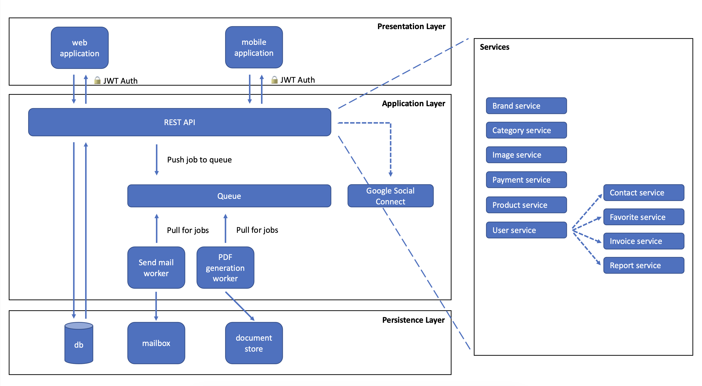
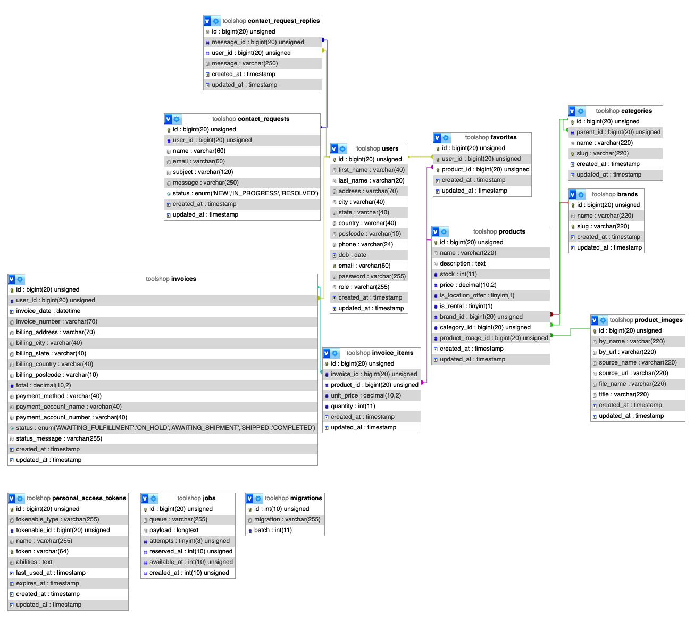

# Architecture

Version 5 of practicesoftwaretesting.com includes all the essential features you'd expect in a real-world project, such as:

- Angular-based front-end
- Laravel back-end, exposing both a RESTful API and a GraphQL API
- React Native mobile application
- Integration with Google Connect for social sign-in
- MySQL database with migration and seeding scripts
- MailHog for testing emails (only available in local deployment)
- Static content delivered via a CDN (Content Delivery Network)
- Queueing system for long-running tasks like sending emails and generating PDFs
- Application caching for most data retrieval functionalities



## Database Model



## Tech Stack

| Layer      | Technology                          |
|------------|-------------------------------------|
| Frontend   | Angular 20, Bootstrap 5             |
| Mobile     | React Native                        |
| Backend    | Laravel 12, PHP 8.3                 |
| Database   | MariaDB 10.6 (MySQL compatible)     |
| Cache      | Redis (via Predis)                  |
| Mail       | MailHog (local) / SMTP (production) |
| Infra      | Docker, Nginx, PHP-FPM             |
| Auth       | JWT, Google OAuth, GitHub OAuth     |
| API (REST) | OpenAPI 3.0 documented via L5-Swagger |
| API (GraphQL) | Lighthouse (`nuwave/lighthouse`) |
| Docs       | Swagger UI + GraphiQL playground    |

## Docker Services

When running locally, the application is composed of these containers:

| Service       | Image / Build            | Port  | Description                     |
|---------------|--------------------------|-------|---------------------------------|
| `laravel-api` | PHP 8.3-FPM Alpine       | 9000  | Laravel API (internal)          |
| `angular-ui`  | Node 20 Alpine           | 4200  | Angular dev server              |
| `web`         | Nginx 1.23 Alpine        | 8091  | Reverse proxy for API           |
| `mariadb`     | MariaDB 10.6.11 Alpine   | 3306  | Database                        |
| `composer`    | Composer 2.6              | -     | Dependency installation         |
| `mailcatcher` | MailHog (optional)        | 1080  | Email testing UI                |
| `phpmyadmin`  | phpMyAdmin (optional)     | 8000  | Database admin UI               |

## APIs

The Laravel back-end exposes **two** APIs against the same data model:

### REST API
- Available since sprint 1
- Documented via **Swagger UI** at `https://api.practicesoftwaretesting.com/api/documentation`
- All endpoints described with OpenAPI 3.0 (`darkaonline/l5-swagger`)
- Used by the Angular front-end and the React Native mobile app for the bulk of read/write operations

### GraphQL API
- Added in sprint 3 onwards (sprint 3, 4, 5, 5-with-bugs)
- Available at `https://api.practicesoftwaretesting.com/graphql`
- Built with **Lighthouse** (`nuwave/lighthouse`) — schema-first GraphQL server for Laravel
- Schema lives at `<sprint>/API/graphql/schema.graphql`
- Reuses the existing Eloquent models (no duplication of business logic)
- Supports queries, mutations, JWT-guarded fields via `@guard`, and relationship eager-loading via `@belongsTo` / `@hasMany`
- Exposes the same entities as the REST API (Product, Brand, Category, User, Invoice, Cart, Favorite, ContactRequest, ProductSpec)

#### Interactive playground
A **GraphiQL** playground is available at `https://api.practicesoftwaretesting.com/graphiql` (`mll-lab/laravel-graphiql`). It works like Swagger UI for REST: browse the schema, autocomplete fields, and run queries against the live API.

#### Where the front-end uses GraphQL
The Angular comparison page (`/comparison`) uses GraphQL with aliased queries to fetch all selected products in a **single round-trip**:

```graphql
{
  p0: product(id: "...") { id name price brand { name } co2_rating specs { spec_name spec_value spec_unit } }
  p1: product(id: "...") { id name price brand { name } co2_rating specs { spec_name spec_value spec_unit } }
  p2: product(id: "...") { id name price brand { name } co2_rating specs { spec_name spec_value spec_unit } }
}
```
This is faster than calling `GET /products/{id}` multiple times via REST and only fetches the fields the comparison page actually needs.
